# To Do List
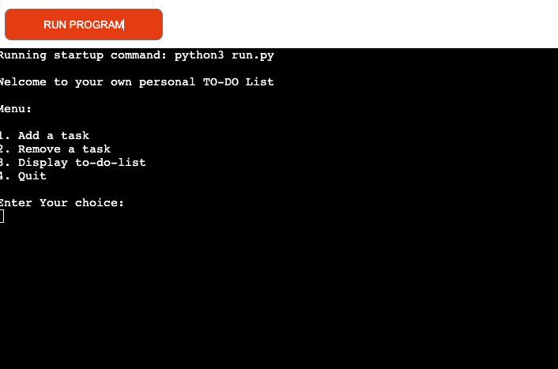

# Repository 

[GitHub Repository](https://github.com/yousefalm1/to-do-list)

Live at: [https://to-do-list-p3-d2dfb93e25e8.herokuapp.com/](https://to-do-list-p3-d2dfb93e25e8.herokuapp.com/)

# Introduction 
Welcome to the To-Do list which is a powerful task management tool which is  designed to help you keep track of your tasks and stay organized in your daily life.

# How To Use 
When you launch the application, you will be met with a welcome message and a menu of options. Select option 1 to add a task, then give a description (e.g., "Complete project report") and, optionally, a due date (e.g., "09/30/2023"). Your task will be put to your local to-do list and, is synchronised with Google Sheets. To delete a task, select option 2, enter the task's index, and it will be removed from your list and Google Sheets, if applicable. Option 3 displays your current tasks together with their indexes and due dates, allowing you to keep track of your to-do list. Finally, option 4 allows you to exit the application once you've completed your tasks management. 

# Features

## Welcome Message And Menu Feature
- When the user runs the To-Do list they are greeted with a welcome message and a interactive menu with four options to choose from:
    1. Add task
    2. Remove task
    3. Display To-Do List
    4. Quit
- Below the menu options the user will be prompted to input the number corresponding to what they want.
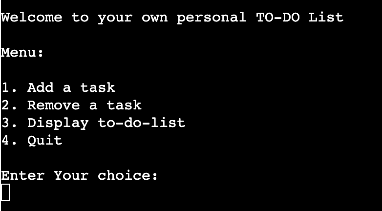

- When the user enters a number that is not between 1 and 4, it displays a message that says "Invalid choice, Please try again" and displays the welcome message and menu for the user to select again.

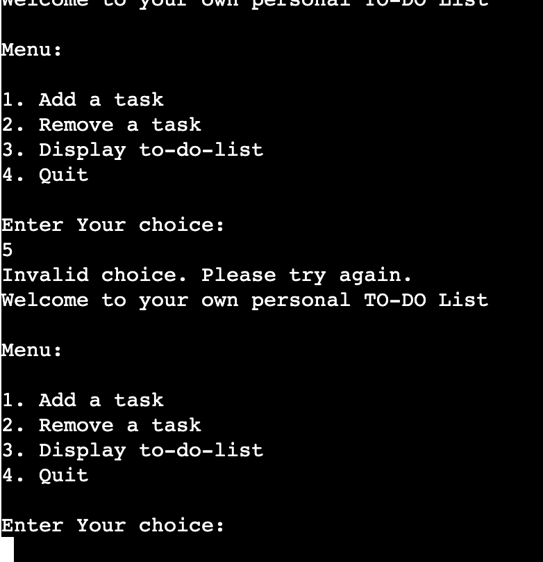

## Add Task Feature

- Add New Task: The application  will prompt the user to input the task you want to add.

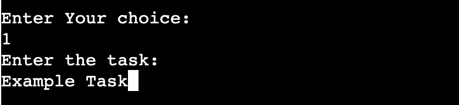

- Add Optional Due Date: The application will also prompt the user to enter a due date for the task which is optional ; if no due date is entered, the task will be recorded as "No due date."

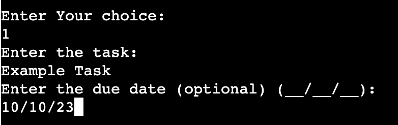

- Google Sheet Integration: Every task the user is not only saved locally but also be transferred to a google sheet document.

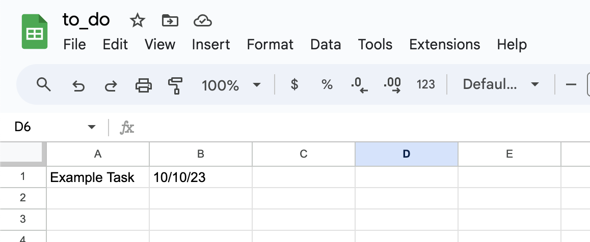

- Success Confirmation: After Adding a task the application will provide a confirmation message, so the user knows that the task has been added both locally and in Google Sheets.

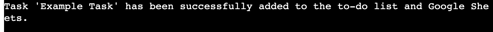

- Error Handling: If any errors occur during adding a task, the application will catch and report them.


## Remove Task Feature

- Remove Task By Index: When the user selects the remove task option the application will display the users current to-do list with the task indices, which will help the user find the task they want to remove

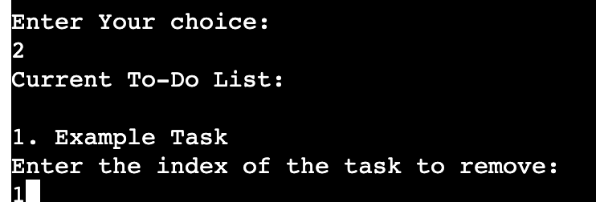

- Google Sheets Integration: When the user removes a task it not only removes it from the local list but also google sheets.

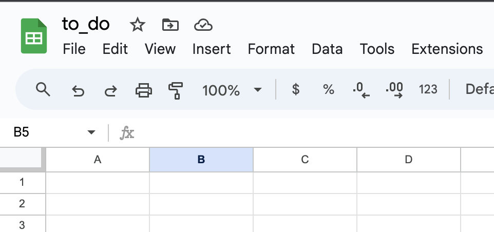

- Success Confirmation: After removing a task from the local list and google sheets the application will provide aconfirmation message.


- Error Handling: If the user enters a wrong index a message will appear stating "Invaid Index" and if an unexpected error occurs the application will catch it and report it.

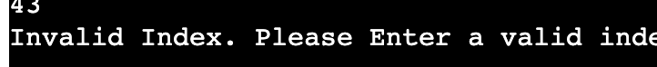

## Quit Feature

- When the user decides  to exit the application, they can do so by selecting the quit option, which ensures the user exits the application safely and efficiently and displays a confirmation message.

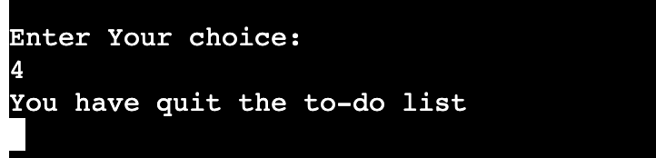

## Future Features 

- In the future i can add other options to add task fucntion for example:
    - Task Priority
    - Task Notes


# Getting Started

## Flow Diagram

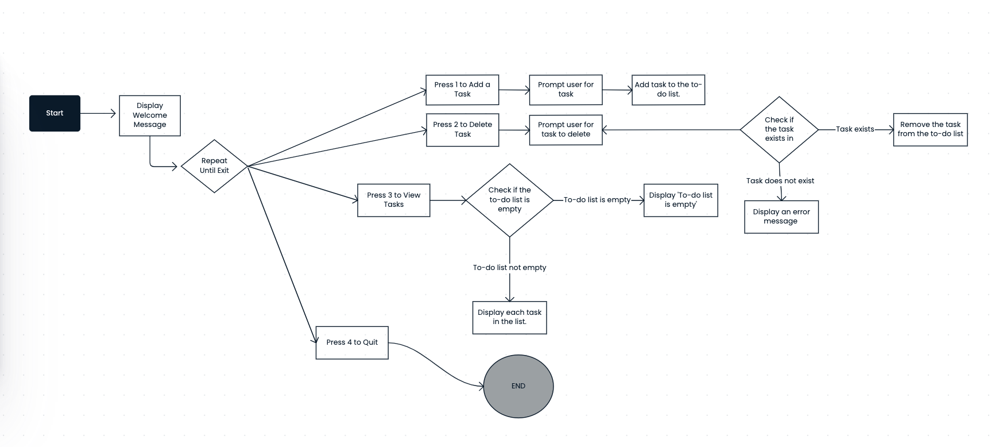


## Prerequisites

1. Clone or Download the Repository:
    - Begin by cloning or downloading this repository and navigate to the project directory.
2. Install Required Python Libraries:
    - Install the necessary Python libraries by running the following command in your terminal:
        ```shell
        pip install gspread google-auth
        ```
3. Obtain Google Drive API Credentials:
    - To access Google Sheets, you'll need Google Drive API credentials in the form of a JSON file.
    - Name this file 'creds.json' and store it in the same directory as the code.
    - Make sure to enable the Google Sheets API for your project.

4. Set Up Google Sheets: 
    - Create a Google Sheets document to store your to-do list.
    - Share this Google Sheets document with the Google service account email found in 'creds.json'.
    - Label the first worksheet in your Google Sheets document as 'Sheet1'.

5. Run the Application:
    - Open your terminal or command prompt.
    - Run the application using this command:
        ```shell
        python3 run.py
        ```

# User Stories

- As a user, I want to be able to add tasks to my to-do list, including optional due dates, so I can keep track of my tasks efficiently.
- As a user, I want to remove tasks from my to-do list when they are completed or no longer relevant, ensuring my list stays up to date.
- As a user, I want to easily view my current to-do list, allowing me to see all the tasks I need to complete.
- As a user, I want the option to quit the program when I'm done using it, ensuring a smooth and convenient experience.

# Technologies Used

- Python
- gspread
- Google Sheets API
- Google OAuth2

# Development and Deployment
I used Codeanywhere as the development environment for this to-do list project.  Regular commits were pushed to GitHub during the creation of the to-do list to track the development stage. The project was deployed on Heroku using Code Institue's mock termianl.

Steps for deployment:
- I created a Heroku account using the student pack provided by Code Institute.
- Next, I clicked on "Create new app" in the Heroku dashboard.
- After clicking "Create new app," I chose an app name and selected my region, then clicked "Create App."
- Once the app was created, I navigated to the settings and scrolled down to the "Config Vars" section. I clicked to reveal config vars and added "CREDS" as the "KEY." In the "Value" field, I copied and pasted the entire contents of the creds.json file and clicked "Add."
- I then scrolled down to the "Buildpacks" section and added both Python and Node.js as buildpacks.
- After adding the buildpacks, I went to the "Deploy" tab and scrolled down to the "Connect to GitHub" section. I clicked on "Connect to GitHub."
- Once connected, I searched for the to-do list repository and connected it to my Heroku app.
- With everything set up, I enabled automatic deploys.
- Heroku began deploying the to-do list application.
- Once the deployment was completed, Heroku provided the URL.
https://to-do-list-p3-d2dfb93e25e8.herokuapp.com/


# Testing

- PEP8 
    - Code was put through https://pep8ci.herokuapp.com/ and the only errors found was line being to long.
    - Manually testing this project in heroku and local terminal. 

- Bugs 
    - The first bug was in the "remove_task" function, where the indentation of the "try" and "except" blocks was incorrect. This caused the "remove_task" function to not work. I fixed this issue by carefully reviewing the code and ensuring that the indentation was correc
    - The second bug was related to the Google Spreadsheet integration not working, causing the tasks not to be updated in the worksheet. This issue arose because I had forgotten to input the email associated with the Google Sheet worksheet. I resolved this problem by revisiting and referencing the "Love Sandwiches" project.
- Remaining Bugs 
    - No bugs remaining

# Credits

- Mentor for this project:
    - Martina Terlevic 

- Online Resourses:
    1. Used https://medium.com/@dghadge2002/building-a-command-line-menu-in-python-exploring-different-applications-f970a61e6412 to understand how to build a Command Line Menu.
    2. Used google to reserach on how to use findall() and enumerate() so i can undertand how to manipulate the data within the project
    3. Used https://www.tutorialstonight.com/reverse-for-loop-python to help understand how to remove tasks from the local list
    4. Used the love sandwhich example project to learn how to implemnt google sheets to the to-do list


